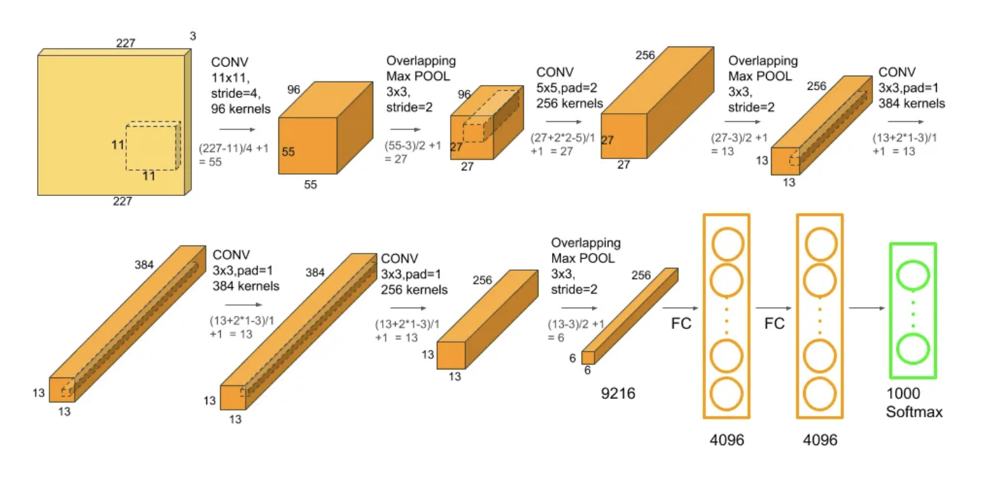

# Architectures CNN Populaires

1. ## **LeNet**

LeNet est l'une des architectures les plus anciennes et les plus célèbres en apprentissage profond, créée par Yann LeCun dans les années 1990\. Elle a été principalement conçue pour la reconnaissance de chiffres manuscrits, comme ceux présents dans le jeu de données MNIST.

### **Structure de LeNet :**

LeNet est une architecture relativement simple, composée de plusieurs couches, chacune ayant un rôle spécifique. Voici les principaux composants de LeNet :

1. **Couches de convolution :** Ces couches sont le cœur de l'architecture. Elles appliquent des filtres (ou noyaux) sur les images d'entrée pour extraire des caractéristiques telles que des bords, des textures ou des formes. LeNet utilise deux couches de convolution. Chaque couche applique plusieurs filtres et produit des cartes de caractéristiques (feature maps).

2. **Couches de sous-échantillonnage (ou "pooling") :** Après les couches de convolution, LeNet utilise une couche de "pooling" pour réduire la taille des cartes de caractéristiques tout en préservant les informations essentielles. Le "pooling" le plus utilisé dans LeNet est le **subsampling** ou **average pooling**, qui effectue une moyenne des valeurs sur une petite zone de la carte de caractéristiques.

3. **Couches entièrement connectées :** Après les couches de convolution et de pooling, les données passent par des couches entièrement connectées, où chaque neurone est relié à tous les neurones de la couche suivante. Ces couches agissent comme un classificateur pour déterminer l'étiquette finale (par exemple, un chiffre de 0 à 9 pour MNIST).

### **Avantages de LeNet :**

* **Simplicité :** LeNet est relativement simple par rapport aux architectures plus récentes, ce qui en fait un bon point de départ pour comprendre les réseaux convolutifs.

* **Efficacité pour les petites images :** À l'origine, LeNet a été conçu pour fonctionner avec des images de petite taille (par exemple, 32x32 pixels), ce qui le rend efficace pour des tâches de reconnaissance d'images simples.

### **Limites de LeNet :**

* **Taille des images :** LeNet a été conçu pour de petites images, ce qui limite son efficacité pour des images de plus grande taille, comme celles utilisées dans les réseaux sociaux ou les vidéos.

* **Manque de profondeur :** Par rapport aux architectures modernes comme VGG ou ResNet, LeNet est assez peu profond et ne peut pas capturer des caractéristiques complexes dans des images complexes.

En résumé, LeNet est une architecture pionnière dans le domaine des réseaux convolutifs et reste un excellent modèle pour apprendre les bases des CNN, même si des architectures plus récentes ont surpassé ses performances pour des tâches plus complexes.

  
Image extraite de :  [https://syedabis98.medium.com/hands-on-guide-to-lenet-5-the-complete-info-b2ae631db34b](https://syedabis98.medium.com/hands-on-guide-to-lenet-5-the-complete-info-b2ae631db34b)

2. ## **AlexNet**

AlexNet est une architecture de réseau de neurones convolutifs (CNN) développée par Alex Krizhevsky, Ilya Sutskever et Geoffrey Hinton en 2012\. Elle a remporté la compétition ImageNet Large Scale Visual Recognition Challenge (ILSVRC) cette année-là en battant les autres modèles avec une réduction significative de l'erreur de classification. AlexNet a démontré l'efficacité des réseaux de neurones profonds et a ouvert la voie à l'usage généralisé des CNN dans le domaine de la vision par ordinateur.

### **Structure d'AlexNet**

1. **Couches de Convolution (5 couches)**  
    **AlexNet** commence par une série de 5 couches de convolution qui extraient différentes caractéristiques à partir de l'image d'entrée. Ces couches ont des filtres plus grands et plus nombreux par rapport à LeNet, permettant de capter des informations plus complexes.

2. **Couches de Pooling (2 couches)**  
    Après chaque série de couches de convolution, AlexNet applique des couches de max pooling pour réduire la taille des cartes de caractéristiques et rendre le modèle plus rapide et moins sujet au sur-apprentissage.

3. **Couches Fully Connected (3 couches)**  
    Après les couches de convolution et de pooling, AlexNet utilise 3 couches entièrement connectées (fully connected layers) pour faire la classification finale.

4. **Fonction d'Activation \- ReLU**  
    AlexNet utilise la fonction d'activation ReLU après chaque couche de convolution et entièrement connectée. Cela permet au réseau d'apprendre des relations non-linéaires, ce qui est essentiel pour la classification d'images complexes.

5. **Normalisation par lots (Batch Normalization)**  
    AlexNet introduit également une forme de normalisation par lots après les couches de convolution, ce qui aide à accélérer l'entraînement et à rendre l'apprentissage plus stable.

6. **Dropout**  
    Afin de réduire le risque de sur-apprentissage (overfitting), AlexNet utilise la technique de dropout sur les couches entièrement connectées, désactivant de manière aléatoire certaines connexions pendant l'entraînement pour encourager la généralisation du modèle.

AlexNet a marqué un tournant majeur dans l'histoire de la vision par ordinateur et des réseaux de neurones profonds. Avec ses 8 couches principales, son usage de ReLU pour activer les neurones et des techniques de régularisation comme dropout et normalisation par lots, il a réussi à surpasser les modèles existants et a ouvert la voie à des réseaux encore plus profonds et plus complexes. En réduisant de manière significative le taux d'erreur sur la tâche de classification d'images, AlexNet a démontré le potentiel des CNN à gérer des données massives et complexes, contribuant ainsi à la popularisation des réseaux de neurones profonds dans diverses applications d'intelligence artificielle.

**![][image37]**  
Image extraite de : [https://karan3-zoh.medium.com/paper-summary-imagenet-classification-with-deep-convolutional-neural-networks-41ce6c65960](https://karan3-zoh.medium.com/paper-summary-imagenet-classification-with-deep-convolutional-neural-networks-41ce6c65960)

3. ## **VGG**

VGGNet est une architecture de réseau de neurones convolutifs (CNN) développée par le groupe de recherche de **Visual Geometry Group** de l'Université d'Oxford. Elle a été présentée dans le cadre de la compétition **ImageNet Large Scale Visual Recognition Challenge (ILSVRC)** en 2014\. L'architecture VGGNet se distingue par sa simplicité et sa profondeur, mettant en avant l'importance de l'utilisation de petites fenêtres de convolution (3x3) empilées pour capturer des informations complexes à différents niveaux d'abstraction.

### **Structure de VGGNet**

1. **Couches de Convolution (16 à 19 couches)**  
    VGGNet se compose principalement de couches de convolution, qui utilisent des **filtres de taille 3x3** et un **stride de 1**. Ces petites tailles de filtres permettent d'extraire des caractéristiques détaillées de l'image tout en maintenant une grande efficacité dans l'apprentissage. **Les premières couches** (C1 à C4) commencent par appliquer des convolutions avec des filtres **3x3**, en doublant progressivement le nombre de filtres à chaque étape. Par exemple, de **64** filtres dans la première couche, à **128** dans la deuxième, puis **256** et **512** dans les couches suivantes.

2. **Couches de Pooling (Max-Pooling)**  
    Après chaque série de convolutions, VGGNet applique des couches de **max pooling** avec un **taille de filtre de 2x2** et un **stride de 2**. Cela permet de réduire la taille des cartes de caractéristiques tout en préservant les informations les plus importantes.

3. **Couches Fully Connected (3 couches)**  
    Après les couches de convolution et de pooling, VGGNet passe à trois couches entièrement connectées (fully connected layers). Ces couches ont un grand nombre de neurones (4096 dans le cas de VGG16) et sont responsables de la classification finale des images.

4. **Fonction d'Activation \- ReLU**  
    VGGNet utilise la fonction d'activation **ReLU** après chaque couche de convolution et chaque couche entièrement connectée. Cela permet d'introduire de la non-linéarité dans le réseau, ce qui est crucial pour la capacité du réseau à apprendre des relations complexes.

5. **Caractéristiques de VGGNet**

   * **Simplicité et profondeur** : VGGNet a une structure relativement simple comparée à d'autres architectures de la même époque, mais sa profondeur (jusqu'à 19 couches dans le cas de VGG19) lui permet de capturer des représentations de plus en plus complexes.  
   * **Importance des petites fenêtres de convolution** : L'usage de **petits filtres 3x3** au lieu de plus grands filtres permet de réduire le nombre de paramètres tout en conservant une grande capacité d'expression du modèle.  
     

VGGNet est reconnu pour sa simplicité et son efficacité, et bien qu'elle soit relativement plus lente à l'entraînement en raison de sa profondeur, elle a servi de base pour de nombreuses architectures plus récentes et plus complexes. L'idée centrale de l'architecture VGG réside dans l'utilisation de petites fenêtres de convolution répétées, ce qui permet de capter des informations de plus en plus fines tout en maintenant une complexité gérable du modèle. Cette approche, bien que relativement coûteuse en termes de calculs, continue d'être un modèle de référence dans le domaine des CNN.

**![][image38]**  
Image extraite de : [https://viso.ai/deep-learning/vgg-very-deep-convolutional-networks/](https://viso.ai/deep-learning/vgg-very-deep-convolutional-networks/)

4. ## **GoogleNet (Inception)**

GoogLeNet, aussi appelé **Inception v1**, est un réseau de neurones convolutifs (CNN) proposé par Google lors de la compétition **ImageNet Large Scale Visual Recognition Challenge (ILSVRC)** en 2014\. Il a marqué une avancée majeure en termes d'efficacité et de performance, en introduisant le concept innovant de **modules Inception** pour améliorer à la fois la profondeur et l'efficacité computationnelle du réseau.

### **Structure de GoogLeNet (Inception)**

1. **Modules Inception**  
    La grande innovation de GoogLeNet est l'utilisation des **modules Inception**, qui permettent au réseau d'extraire plusieurs types de caractéristiques en parallèle.  
    Chaque module Inception applique simultanément :

   * **Des convolutions 1x1, 3x3, et 5x5** pour capturer différentes tailles de motifs.  
   * **Du max pooling 3x3** pour réduire la dimension et extraire des caractéristiques robustes. Les résultats de toutes ces opérations sont ensuite concaténés le long de la dimension des canaux (profondeur).  
   * **Convolutions 1x1** : utilisées pour réduire le nombre de canaux avant d'appliquer les convolutions plus lourdes (3x3, 5x5), ce qui permet de réduire le coût en calculs.  
   * Ce mécanisme permet au réseau d'être à la fois **large** et **profond** sans exploser en nombre de paramètres.

2. **Couches de Convolution**  
    GoogLeNet commence avec quelques couches classiques de convolution et de pooling pour réduire la taille de l'image initiale avant de passer à une série de modules Inception.

   * L'utilisation de **convolutions 1x1** est fréquente, notamment pour faire des réductions de dimensions avant des opérations plus coûteuses.

3. **Global Average Pooling**  
    Contrairement à VGGNet qui utilise de grandes couches entièrement connectées à la fin, GoogLeNet utilise une opération de **global average pooling**.

   * Cette opération consiste à prendre la moyenne de chaque carte de caractéristiques, ce qui réduit la sortie à une seule valeur par carte.  
   * Cela permet de diminuer considérablement le nombre de paramètres et de réduire les risques de surapprentissage.

4. **Pas de Couches Fully Connected Massives**  
    GoogLeNet n'utilise pas de couches entièrement connectées traditionnelles volumineuses comme VGGNet. Cela réduit drastiquement la taille du modèle (environ **5 millions de paramètres** contre plus de **100 millions** pour VGGNet) tout en maintenant une très haute performance.

5. **Fonction d'Activation \- ReLU**  
    Après chaque convolution, GoogLeNet utilise la fonction d'activation **ReLU**, qui introduit de la non-linéarité et permet un apprentissage plus rapide et plus efficace.

6. **Caractéristiques de GoogLeNet (Inception)**

   * **Modules multi-chemins** : le réseau apprend des caractéristiques à plusieurs échelles en même temps.  
   * **Efficacité** : une architecture très profonde sans explosion du nombre de paramètres.  
   * **Meilleure généralisation** : la structure multi-niveaux aide à capturer des détails fins tout en gardant la capacité à généraliser sur de nouvelles données.

GoogLeNet a démontré qu'il était possible de construire des réseaux très profonds tout en gardant l'efficacité computationnelle, en s'appuyant sur une conception intelligente des architectures internes comme les modules Inception. Cette approche a inspiré de nombreuses versions améliorées (Inception v2, v3, v4) et reste l'une des contributions fondamentales dans l'évolution des architectures de réseaux de neurones convolutifs.

5. ## **ResNet (Residual Networks)**

ResNet, ou **Residual Network**, est une architecture introduite par Microsoft Research en 2015 lors de la compétition **ImageNet Large Scale Visual Recognition Challenge (ILSVRC)**. ResNet a non seulement remporté la compétition avec un score record, mais a aussi marqué un tournant dans l'histoire des réseaux profonds grâce à l'introduction des **blocs résiduels**, permettant d'entraîner des réseaux extrêmement profonds sans perdre en efficacité.

#### **Structure de ResNet (Residual Networks)**

1. **Blocs Résiduels (Residual Blocks)**  
    L'innovation principale de ResNet est l'utilisation de **connexions de saut (skip connections)** :

   * Au lieu de simplement empiler des couches les unes sur les autres, ResNet apprend la **différence** (résidu) entre l'entrée et la sortie d'un bloc de couches.  
   * Chaque bloc résiduel contient une ou plusieurs couches de convolution, mais en plus, il ajoute l'entrée du bloc directement à la sortie après ces couches.

2. Mathématiquement, au lieu d'apprendre une fonction complexe H(x)H(x)H(x), le réseau apprend une fonction plus simple F(x)=H(x)−xF(x) \= H(x) \- xF(x)=H(x)−x, ce qui permet de mieux guider l'apprentissage.

   * **Skip connections** : facilitent la circulation du gradient lors du backpropagation, ce qui rend possible l'entraînement de réseaux beaucoup plus profonds sans problème de dégradation.

3. **Couches de Convolution**  
    ResNet utilise des couches de convolution standards combinées avec :

   * **Batch Normalization** après chaque convolution, pour stabiliser l'entraînement.  
   * **Fonction d'activation ReLU** pour introduire la non-linéarité.

4. **Architecture Très Profonde**  
    Grâce aux blocs résiduels, ResNet peut être construit avec beaucoup plus de couches que les architectures précédentes sans dégradation de la performance.

   * Les modèles classiques de ResNet sont : **ResNet-18**, **ResNet-34**, **ResNet-50**, **ResNet-101**, et **ResNet-152** (le chiffre représente le nombre de couches).

5. **Global Average Pooling et Couches Fully Connected**  
    Comme GoogLeNet, ResNet utilise du **global average pooling** avant la dernière couche fully connected, ce qui permet de réduire le nombre de paramètres par rapport aux architectures plus anciennes comme VGGNet.

6. **Fonction d'Activation \- ReLU**  
    Après chaque convolution et normalisation, ResNet utilise la fonction **ReLU**, qui permet un apprentissage rapide et évite la saturation des gradients.

7. **Caractéristiques de ResNet**

   * **Très grande profondeur** : possible grâce aux connexions résiduelles.  
   * **Amélioration du flux de gradients** : facilite l'entraînement en réduisant le risque de disparition ou explosion du gradient.  
   * **Excellentes performances** sur de nombreuses tâches de vision par ordinateur, y compris la classification, la détection et la segmentation.

ResNet a ouvert la voie à des réseaux extrêmement profonds, en rendant l'entraînement plus stable et plus efficace. Le concept de connexions résiduelles est aujourd'hui omniprésent dans les architectures modernes, bien au-delà de la vision par ordinateur.

![][image39]

Image extraite de : [https://arxiv.org/pdf/1512.03385.pdf](https://arxiv.org/pdf/1512.03385.pdf)

6. ## **DenseNet (Densely Connected Convolutional Networks)**

DenseNet est une architecture introduite en 2017 qui améliore encore l'idée de faciliter la circulation de l'information dans les réseaux profonds. Là où ResNet ajoute des connexions résiduelles entre les couches, **DenseNet** va encore plus loin en connectant **chaque couche** à **toutes les couches suivantes**. Cela permet d'améliorer le flux d'information et de gradients dans tout le réseau.

#### **Structure de DenseNet**

1. **Connexions Denses (Dense Connections)**  
    Dans DenseNet, chaque couche reçoit en entrée :

   * Les sorties de **toutes les couches précédentes**, et  
   * Son propre output est envoyé à **toutes les couches suivantes**.

2. Autrement dit, au lieu de n'envoyer son output qu'à la couche suivante immédiate, chaque couche partage ses résultats avec toutes celles qui viennent après. Cela signifie que si vous êtes à la couche lll, son entrée est la **concaténation** des sorties de toutes les couches précédentes.

    Cette approche rend l'apprentissage plus efficace, car :

   * Les premières couches restent accessibles par les couches profondes.  
     Les gradients circulent mieux pendant l'entraînement.  
   * Le réseau est plus **paramètre-efficient** (il utilise moins de poids pour obtenir de bonnes performances).

3. **Dense Blocks et Transition Layers**  
    DenseNet est organisé en alternance entre :

   * **Dense Blocks** : plusieurs couches densément connectées.  
     **Transition Layers** : elles réduisent la taille des feature maps par pooling et compression pour contrôler la croissance du réseau.

4. **Couches de Convolution et Normalisation**  
    Chaque couche standard dans un Dense Block est composée de :

   * **Batch Normalization**  
   * **ReLU**  
   * **Convolution 3×33 \\times 33×3**

5. Avant chaque Dense Block, il peut y avoir une convolution 1×11 \\times 11×1 pour réduire le nombre de canaux.

6. **Architecture Profonde mais Efficace**  
    DenseNet permet d'avoir des réseaux très profonds, mais avec **moins de paramètres** qu'un réseau classique ou même qu'un ResNet de profondeur similaire.

7. **Fonction d'Activation \- ReLU**  
    Comme dans beaucoup d'autres architectures modernes, DenseNet utilise **ReLU** après la normalisation et avant la convolution pour introduire la non-linéarité.

8. **Caractéristiques de DenseNet**

   * **Propagation efficace** de l'information et des gradients.  
   * **Moins de paramètres** grâce au partage intensif d'informations.  
   * **Réduction du surapprentissage** (overfitting) sur des petits jeux de données.  
   * **Utilisation optimale des features** extraits par les différentes couches.

DenseNet a prouvé qu'il était possible d'entraîner des réseaux encore plus profonds tout en restant léger et efficace. Aujourd'hui, les idées de connexions denses inspirent de nombreuses architectures modernes dans le domaine de la vision et au-delà.

![][image40]  
Image extraite de : [https://paperswithcode.com/method/densenet](https://paperswithcode.com/method/densenet)

7. ##  **Xception**

Xception est une architecture proposée en 2017 qui peut être vue comme une extension et une amélioration d'Inception. L'idée principale est de simplifier les modules complexes d'Inception en remplaçant les convolutions classiques par une approche plus efficace appelée **convolutions séparables en profondeur** (*depthwise separable convolutions*).

### **Structure de Xception**

1. **Convolutions Séparables en Profondeur**  
    Au lieu d'appliquer une convolution standard qui mélange l'information spatiale (largeur et hauteur) et l'information entre canaux en même temps, Xception sépare les deux opérations :

   * **Depthwise Convolution** : une convolution est appliquée **indépendamment sur chaque canal**.  
   * **Pointwise Convolution (1×1)** : ensuite, une convolution 1×11 \\times 11×1 est utilisée pour mélanger les canaux.

2. Cette décomposition permet de **réduire le nombre de paramètres** tout en capturant efficacement l'information.

3. **Architecture Basée sur une Structure Modulaire**  
    Xception est organisé en trois grandes parties :

   * **Entrée (Entry Flow)** : plusieurs convolutions classiques pour extraire des premières caractéristiques.  
   * **Corps Principal (Middle Flow)** : une série de modules basés uniquement sur des convolutions séparables en profondeur.  
     **Sortie (Exit Flow)** : prépare les représentations finales pour la classification.

4. **Convolutions avec Strides et Pooling**  
    Certaines convolutions utilisent un **stride** supérieur à 1 pour réduire la taille spatiale des feature maps, jouant le rôle de réduction comme un pooling.

5. **Utilisation de Batch Normalization et ReLU**  
    Après chaque convolution (que ce soit depthwise ou pointwise), il y a une étape de **Batch Normalization** suivie d'une activation **ReLU** pour accélérer et stabiliser l'entraînement.

6. **Absence de Modules Inception Complexes**  
    Contrairement à GoogLeNet qui utilisait différents types de convolutions 1×11 \\times 11×1, 3×33 \\times 33×3, etc., en parallèle dans chaque bloc, Xception utilise uniquement des convolutions séparables de manière simple et séquentielle.

7. **Caractéristiques de Xception**

   * **Meilleure efficacité** : moins de paramètres et de calculs qu'une architecture Inception classique.  
   * **Performance élevée** : résultats compétitifs sur des bases de données comme ImageNet.  
   * **Modèle élégant** : l'approche purement basée sur des convolutions séparables en profondeur est simple et puissante.

Xception a montré qu'en repensant complètement la manière de faire des convolutions, on pouvait obtenir des réseaux plus légers et plus performants. C'est un modèle très utilisé dans les systèmes embarqués et les applications où l'efficacité est essentielle.

![][image41]

Image extraite de : [https://www.researchgate.net/figure/Proposed-structure-of-Xception-network-used-within-each-stream-of-CNN\_fig2\_355098045](https://www.researchgate.net/figure/Proposed-structure-of-Xception-network-used-within-each-stream-of-CNN_fig2_355098045)

#### **Liens Externes (Youtube, Medium, etc):**

* [Lecture 9 : Popular CNN Architectures](https://youtu.be/DAOcjicFr1Y?si=_2Ov4AH417rN4xbi)  
* [Hands on guide to LeNet-5 (The Complete Info)](https://syedabis98.medium.com/hands-on-guide-to-lenet-5-the-complete-info-b2ae631db34b)  
* [Paper Summary: ImageNet Classification with Deep Convolutional Neural Networks](https://karan3-zoh.medium.com/paper-summary-imagenet-classification-with-deep-convolutional-neural-networks-41ce6c65960)  
* [Paper Summary: Very Deep Convolutional Networks for Large-Scale Image Recognition](https://karan3-zoh.medium.com/paper-summary-very-deep-convolutional-networks-for-large-scale-image-recognition-e7437959d856)  
* [Going deeper with convolutions: The Inception paper, explained](https://medium.com/aiguys/going-deeper-with-convolutions-the-inception-paper-explained-841a0c661fd3)  
* [Understanding ResNet Architecture: A Deep Dive into Residual Neural Network](https://medium.com/@ibtedaazeem/understanding-resnet-architecture-a-deep-dive-into-residual-neural-network-2c792e6537a9)  
* [Paper review: DenseNet \-Densely Connected Convolutional Networks](https://medium.com/data-science/paper-review-densenet-densely-connected-convolutional-networks-acf9065dfefb)  
* [Xception: Deep Learning's Leap Beyond Inception](https://medium.com/@kdk199604/xception-deep-learnings-leap-beyond-inception-05a708c205f9)

#### **Bibliographie**

* LeCun, Y., Bottou, L., Bengio, Y. and Haffner, P., 1998\. Gradient-based learning applied to document recognition. *Proceedings of the IEEE*, *86*(11), pp.2278-2324.  
* Krizhevsky, A., Sutskever, I. and Hinton, G.E., 2012\. Imagenet classification with deep convolutional neural networks. *Advances in neural information processing systems*, *25*.  
* Simonyan, K. and Zisserman, A., 2014\. Very deep convolutional networks for large-scale image recognition. *arXiv preprint arXiv:1409.1556*.  
* Szegedy, C., Liu, W., Jia, Y., Sermanet, P., Reed, S., Anguelov, D., Erhan, D., Vanhoucke, V. and Rabinovich, A., 2015\. Going deeper with convolutions. In *Proceedings of the IEEE conference on computer vision and pattern recognition* (pp. 1-9).  
* He, K., Zhang, X., Ren, S. and Sun, J., 2016\. Deep residual learning for image recognition. In *Proceedings of the IEEE conference on computer vision and pattern recognition* (pp. 770-778).  
* Huang, G., Liu, Z., Van Der Maaten, L. and Weinberger, K.Q., 2017\. Densely connected convolutional networks. In *Proceedings of the IEEE conference on computer vision and pattern recognition* (pp. 4700-4708).  
* Chollet, F., 2017\. Xception: Deep learning with depthwise separable convolutions. In *Proceedings of the IEEE conference on computer vision and pattern recognition* (pp. 1251-1258).
